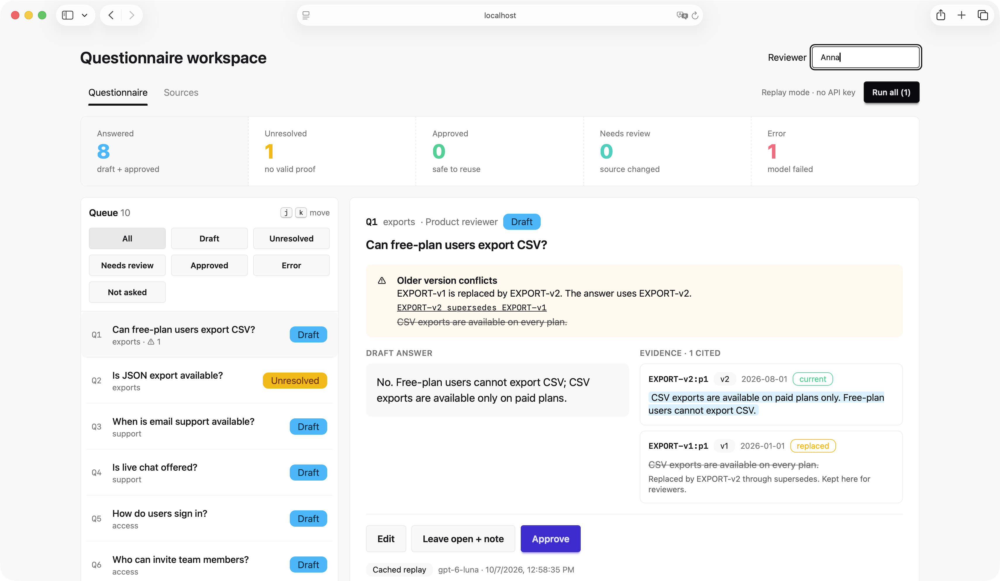
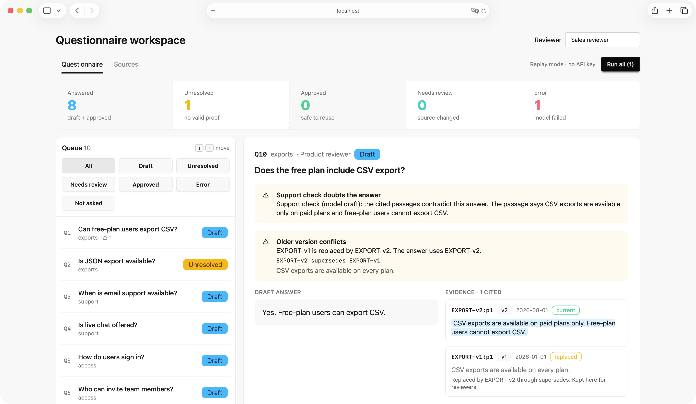

# Questionnaire Evidence and Review Workspace

A small local web app. A sales team gets buyer questions. The app drafts each answer from the company documents, shows the proof, and lets a person edit and approve it. An approved answer is reused when the same question comes again. If a source document changes, the approved answer goes back to review.



All people, companies and policies in the data are fictional.

## Highlights

- **Code sets every status. The model never does.** The model returns an answer, a verdict and passage IDs. Code checks each ID against the passages that were sent and copies the passage text as the excerpt.
- **Support check.** After a good draft, a second model call asks whether the cited text supports the answer. It adds a warning only: the status stays `draft` and Approve stays on, because a wrong flag must not block a good answer. Demo with no key: Q10 is a simulated draft that says "Yes" and cites a passage that says the opposite, and the check flags it. Q3 gets no warning.
- **Authority comes from `supersedes`, never from a date.** Passages of a replaced document are not sent to the model. The reviewer still sees them, struck through, next to the current answer (Q1).
- **Reuse and source change.** An approved answer is reused with no model call. Each approval saves the source versions it cites. If one changes, the answer shows `needs review` and is not reused until it is approved again.
- **Every model call is saved once**, with prompt, raw reply, model, settings, latency and token counts, and a label: `real`, `cached` or `simulated`. Failures show as `error` with a short message, and the other questions go on.
- **No key needed.** The app and `make checks` replay saved real replies.



## Setup and run

You need `uv` (Python 3.12 or newer), `pnpm`, and `make`.

```bash
cd backend && uv sync          # Python dependencies
cd ../frontend && pnpm install # Frontend dependencies
cd ..
make start                     # build the Frontend, serve everything on http://localhost:8000
```

| Command | What it does |
| ------- | ------------ |
| `make start` | Builds the Frontend and starts the Backend on port 8000 (`/api/*` and the built Frontend). Replay mode unless `MODEL_MODE=real`. |
| `make checks` | Runs the five checks and Case 6 in replay mode and writes `docs/check-results.md`. Exit code 0 when all pass, 1 when a case fails, 2 when `data/reference-cases.json` is not valid. |
| `make reset` | Deletes the Database file for a clean demo. |
| `make test` | `tsc`, `vite build` and `pytest`. |
| `make record` | Real model calls for the replay file. Needs `OPENAI_API_KEY`. Not needed to run the app. |

`make dev` (Backend with reload plus the Vite dev server on port 5173) and `make types` (regenerate `frontend/src/api/api.d.ts`) are for development.

## Replay without a key

With no `MODEL_MODE` set, the Drafter reads saved real model replies from `replay/responses.json`. The label of such a call is `cached`. A failure made on purpose has the label `simulated`. A call to the real model has the label `real`.

A replay entry is found by `input_hash`, which covers the model name, the settings, the system prompt, the question text and the passages that were sent. If one of them changes, the question gets the status `error` with "No saved response for this input." until `make record` saves new replies. Never edit `replay/responses.json` by hand.

To use the real model, copy `.env.example` to `.env`, fill in the values, and start with `MODEL_MODE=real`.

| Name | Use |
| ---- | --- |
| `MODEL_MODE` | `real` asks the model. Anything else, or empty, is replay. |
| `OPENAI_API_KEY` | The key for `real` mode and for `make record`. |
| `MODEL_NAME` | The model. Default `gpt-6-luna`. |
| `DB_PATH` | The SQLite file. Default `backend/qws.db`. |

## Architecture

```text
Browser ── React app (Vite, TanStack Router and Query, generated types)
   │  only draws and sends clicks; it has no business rule
   ▼
backend/src/qws
  api/        FastAPI routes, serves the built Frontend (index.html for deep links)
  services/   DraftService, ReviewService, seed_loader, recorder
  checks.py   the `make checks` runner (drives the app through its API)
  core/       pure rules and Pydantic models (status, warnings, prompts, hashes)
  adapters/   Store (plain sqlite3), Drafter: RealDrafter, ReplayDrafter, SimulatedDrafter
```

- All business logic is in the Backend. The Frontend shows what the Backend sends, including `allowed_actions`.
- The `Drafter` is a port. `RealDrafter` uses a PydanticAI `Agent` with OpenAI. `ReplayDrafter` reads the replay file. Both go through the same validation, so replay tests the same checks.
- Storage is SQLite with plain SQL in `backend/schema.sql`: `document`, `passage`, `owner`, `question`, `model_call`, `draft`, `approved_answer`. A model call is written once and never changed. Model output (`draft`) and approved answers are in different tables.
- The status `needs review`, the owner, and the replaced text are computed when they are read. They are not stored.

## Workflow

Code loads the data once, at start. Then each question goes through four steps. The model does step 2, and the support check inside step 3. Code does steps 1 and 3. A person does step 4. Steps 2 and 3 run only when the question has no approved answer.

```text
 LOAD (once, at start) ............................................. (code)
   read seed → check IDs → store (INSERT OR IGNORE) → compute question_hash
   problems are shown, the other questions continue

 FOR EACH QUESTION

 [1] Find an approved answer ....................................... (code)
      │   same question_hash = same topic + normalized text, approved answers only
      │
      ├── found, source versions same ──────► APPROVED
      │                                       answer + approver + sources
      │                                       NO model call. STOP.        [Case 4]
      │
      ├── found, a source version changed ──► NEEDS REVIEW
      │                                       old answer + warning
      │                                       NO model call. Go to [4].   [Case 5]
      │
      └── none
           ▼
 [2] Ask the model ................................................. (MODEL)
      │   prompt = question + passages of CURRENT documents only
      │   (a document is replaced through "supersedes" only, never by date)
      │   model returns { answer, verdict, citations: passage IDs }
      │   code saves the model_call: prompt, raw reply, model, settings,
      │   tokens, latency, label (real / cached / simulated)
      │
      ├── API fail / bad JSON / fails schema ──► ERROR + short message  [Case 6]
      │                                          [Retry] asks again
      ▼
 [3] Check and set the status ...................................... (code)
      │   every cited ID is one of the passages sent?
      │   code copies the passage text into the draft as the excerpt
      │
      ├── verdict "not documented" ───────────► UNRESOLVED + owner     [Case 2]
      ├── ID not sent, or empty list ─────────► UNRESOLVED + warning
      ├── conflict, no supersedes link ───────► UNRESOLVED + both texts
      └── checks pass ────────────────────────► DRAFT                  [Case 1, 3]
               │  a cited document supersedes another:
               │  code adds the replaced text + warning                [Case 3]
               ▼
           support check (second model call, only on a good draft)
               does the cited text support the answer?
               "contradicts", "unclear" or a failed call → warning only.
               The status stays DRAFT and Approve stays on.
      ▼
 [4] Reviewer ...................................................... (PERSON)
      │
      ├── on DRAFT or NEEDS REVIEW:  [Edit]  [Approve]  [Leave open + note]
      │       Edit     → stays DRAFT, not reused
      │       Approve  → APPROVED. Saves answer, citations, source
      │                  versions, approver, time
      │       Leave open + note → saves the note. DRAFT becomes UNRESOLVED.
      │                  NEEDS REVIEW keeps its status.
      │
      └── on UNRESOLVED:  [Leave open + note] only (no valid citation = no proof)

 Same question again → [1] → APPROVED (reuse)                         [Case 4]
 Bump a source version → [1] → NEEDS REVIEW                           [Case 5]
 Model fails (simulated Q9) → ERROR, the other questions go on        [Case 6]
```

`make checks` runs the five checks and Case 6 in replay mode:

| Case | Question | Checks |
| ---- | -------- | ------ |
| C1 | Q3 | A supported question gets a draft with a real citation |
| C2 | Q2 | An undocumented feature stays `unresolved`, with an owner |
| C3 | Q1 | The older policy conflict is shown, and the answer cites the replacing document |
| C4 | Q1 | An edit is not reused. After Approve, asking again makes no model call |
| C5 | Q1 | Approval survives a restart. After a bump of `EXPORT-v2`, the answer needs review |
| C6 | Q9 | A failed call shows as `error`, label `simulated`. The other questions go on |

The expected values are in `data/reference-cases.json`, each with a `source` note. The latest table is in `docs/check-results.md`.

## Two status words

- `unresolved`: the app has no valid proof. The feature is not documented, a citation is not valid, or a conflict has no `supersedes` link. `domain.md` also says "needs review" for the JSON question. This project says `unresolved` for it.
- `needs review`: an approved answer whose source document changed its version. It is not reused until a person approves it again.

## Model configuration

| Item | Value |
| ---- | ----- |
| Provider and API | OpenAI, Responses API, through PydanticAI 2.54.0 (`OpenAIResponsesModel`) |
| Model | `gpt-6-luna` (change with `MODEL_NAME`) |
| Settings | `temperature` 0, `max_tokens` 1000, `openai_reasoning_effort` `medium` |
| Output | Typed with `NativeOutput`: `Reply` for the draft, `SupportReply` for the support check |
| Agent | `retries=0`, no tools. Our code decides when to ask again. Timeout 60 seconds, no client retries |
| Prompts | `SYSTEM_PROMPT` and `SUPPORT_SYSTEM_PROMPT` in `backend/src/qws/core/rules.py`. Passages go in the user message, as data |

Each model call is saved with its prompt, raw reply, model, settings, latency and token counts. Latency and tokens are measured on `real` calls only. They are `NULL` for `cached` and `simulated` calls, and the screen does not show them. Errors show as a short message, never a stack trace or a key.

## Data assumptions

- `data/seed.json` has 5 documents, 8 questions (Q1 to Q8) and the topic-to-reviewer map. `data/domain.md` and `data/expected-seed-results.json` are copies of the supplied files. The app never changes them.
- `data/demo.json` adds two questions. Q9 has a simulated failure for Case 6. Q10 has a simulated draft that says "Yes" and cites a passage that says the opposite, for the support check.
- Authority comes from `supersedes` only. The seed `status` label and the date are not used. A document is current when no other document replaces it.
- Owners come from the map. The app never invents one. A topic with no owner is shown as a load issue. The reviewer name is free text. There is no login.
- A question matches an approved answer when the topic and the normalized text are the same.
- Load uses `INSERT OR IGNORE`, so a bumped version survives a restart. Use `make reset` to start again. The bump endpoint adds 1 to a document version and stands for a changed source.
- Only the supplied documents are evidence. There is no PDF reading, no embeddings and no CRM.

## Known limits

- **Checks:** code checks that each cited ID was sent and copies the passage text. It does not check that the answer reads the passage correctly. The support check covers part of that, but it is a model call and can be wrong. It adds a warning only, and the reviewer decides.
- **Question matching:** exact match after normalization. No fuzzy match. A question with two parts is not handled.
- **Passages:** the model gets all passages of current documents. There is no search step. This works for a small collection only.
- **Replay:** a change of the model name, the settings, a prompt or a passage text changes the `input_hash`, and replay finds no entry until `make record` runs again.
- **Review:** a bump changes only the version number, so approving again does not check the citations against the passage text. An approved answer is read only. A repeated question that has an approval but no draft of its own cannot be edited.
- **Frontend:** no automated tests. `make test` runs `tsc` and `vite build` for it. The screen was checked by hand (see `docs/walkthrough.md`).

## Documents

- `docs/check-results.md`: expected and observed values of the six cases.
- `docs/walkthrough.md`: the approach, the decisions, and the list of 5 screenshots with their cases.
- `docs/llm-usage.md`: tools, models, generated parts, one instruction, one correction.
- `ai-workflow/`: the AI configuration record (`manifest.json` and `README.md`).
