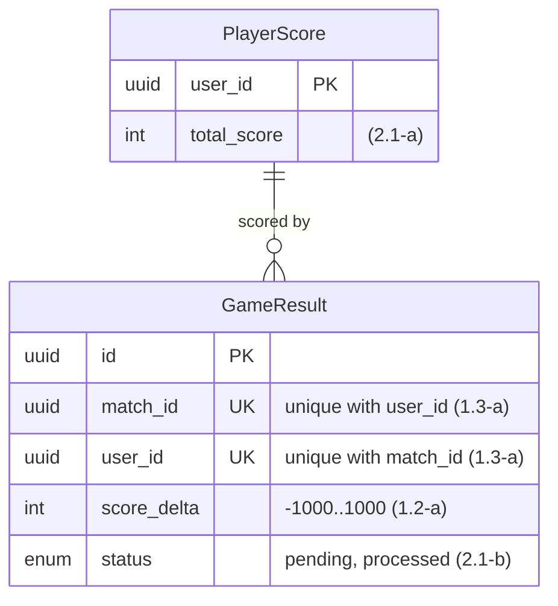
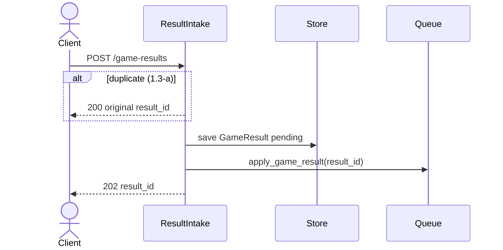

# Blueprint

Everything the engineer approves is monospace, so it reads the same in the terminal, the editor, and on GitHub. Main flow and Data model are the exceptions: Mermaid, because a picture shows order and relationships that text hides.

The example shows each section's shape. Rules it cannot show:

- **Module map** reads top to bottom, from the entry point to the observable result, with one `▼` into each component. Each `├──` branch names the store or service it touches and the data it reads or writes (`store: save GameResult(status=pending)`), never a module, method signature or file name: those belong in Modules and the code. The Dependencies list follows the tree.
- **External interface** lists every entry point a caller uses and every side effect another system reads. A shared path prefix is stated once as `base`. Each `output` line holds one outcome, its cause on the right, and the example IDs that prove it; a queue message's outputs are ack, drop or requeue. A `tests` line names the lower entry point when the real one cannot run inside a test.
- **Data model** is a Mermaid `erDiagram`: every new or changed table with its keys, foreign keys, and the columns a rule or example depends on (example ID in the column comment). Below it, bullets name new and changed tables, the columns left out, and the invariants.
- **Main flow** is optional: add it when order or failure branches matter; at most 6 participants and 3 `alt` branches, each labelled with its example ID.
- **Key design decisions**: Source is `grilling` for a carried-forward decision, `new` for a choice the grilling did not settle, or `overturned` when new evidence replaces a grilling decision; an `overturned` row names the decision it replaces and the evidence.
- **QA notes** cover critical stories (requirements with ✅ examples) with repository-verified commands; label proposed entry points.

Keep each line within 100 characters. In Mermaid labels, never use `;` (it ends the statement and the
diagram fails to render as a picture), `#`, or `<>`.

## Example

Match its density; replace the content with the change's own.

~~~~markdown
## Design

### Destination

A client submits a game result once, and the player's score and the leaderboard reflect it within seconds.

### Module map

```text
Client
  │ POST /game-results
  ▼
Results API [change]
  │ submit(result)
  ▼
ResultIntake [new]
  ├── store: save GameResult(status=pending)
  └── queue: send apply_game_result(result_id)
                    │
                    ▼
             ScoreProjector [change]
               ├── store: add score_delta to PlayerScore
               ├── leaderboard view: set user score
               └── store: mark GameResult(status=processed)

Dependencies
  Results API    → ResultIntake → store, queue
  worker         → ScoreProjector → store, leaderboard view
  ResultIntake   -X-> ScoreProjector
  ScoreProjector -X-> Results API
```

### External interface

```text
base /api

POST /game-results [new]
  input   { match_id: uuid, user_id: uuid, score_delta: int }
  output  202 { result_id, status: "pending" }   new result                    (1.1-a ✅)
          200 { result_id, status }              same (match_id, user_id) again (1.3-a ✅, 1.3-b)
          422 { error: "score_out_of_range" }    score_delta outside -1000..1000 (1.2-a ✅)

apply_game_result, queue message [new]
  input   { result_id: uuid }
  output  ack                                    applied, or already processed (2.1-a ✅, 2.1-b)
  tests   call ScoreProjector.apply(result_id); the worker cannot run inside a test
```

### Modules

```text
ResultIntake [new]
  hides:  validation, duplicate detection, queueing
  offers: submit(result) → accepted(result_id) | duplicate(result_id) | rejected(reason)
  rules:
    - score_delta outside -1000..1000 → rejected              (1.2-a ✅)
    - same (match_id, user_id) twice → the original result_id  (1.3-a ✅, 1.3-b)
    - save before sending, so the worker never sees an unknown id  (1.1-a ✅)

ScoreProjector [change]
  hides:  score math, leaderboard refresh
  offers: apply(result_id)
  rules:
    - add score_delta to PlayerScore, then refresh the leaderboard  (2.1-a ✅)
    - a processed result is skipped                            (2.1-b)
```

### Data model



- New: GameResult, Leaderboard. Changed: PlayerScore.
- Leaderboard is a derived view: member user_id, score total_score.
- A result changes a score at most once.
- PlayerScore is authoritative; the leaderboard can be rebuilt from it at any time.

### Main flow



### Key design decisions

| Decision | Choice | Why | Rejected alternative | Source |
| -------- | ------ | --- | -------------------- | ------ |
| Score update timing | Async worker | Submit stays fast under load | Update in the request: slow, retries hard | grilling |
| Duplicate owner | ResultIntake | One place decides; API stays thin | Unique-violation handling in the API | new |

### QA notes

#### Submit a result once

Requirements: 1.1, 1.3  
Setup: player `u1` with total_score 10  
Run: `make run`  
Open: `POST http://localhost:8000/game-results`

| Step | Action | Expected result |
| ---- | ------ | --------------- |
| 1 | Submit `{match m1, user u1, score_delta 5}` | 202 with a result_id |
| 2 | Submit the same body again | 200 with the same result_id |
| 3 | Read u1's score after a few seconds | total_score 15 |
~~~~
